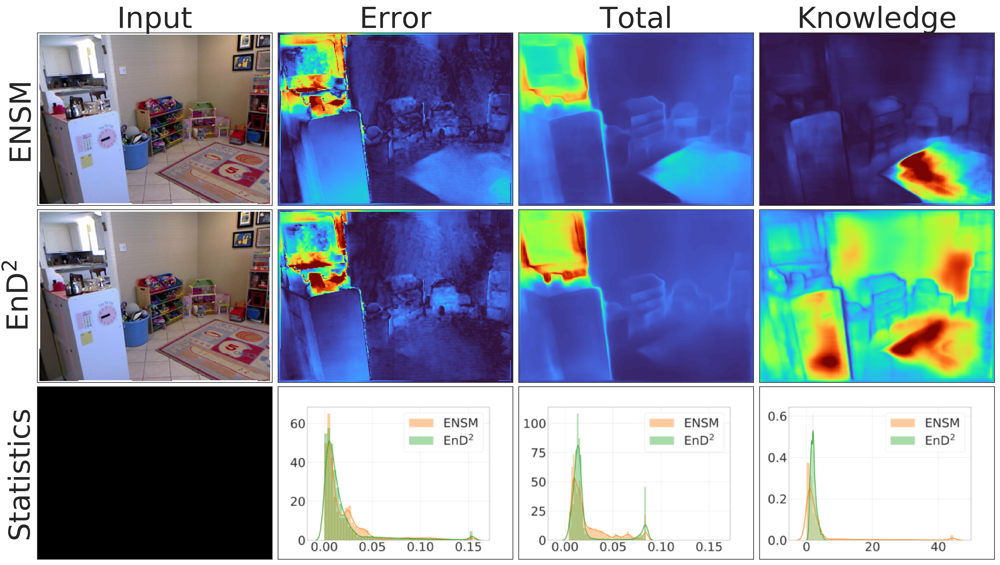
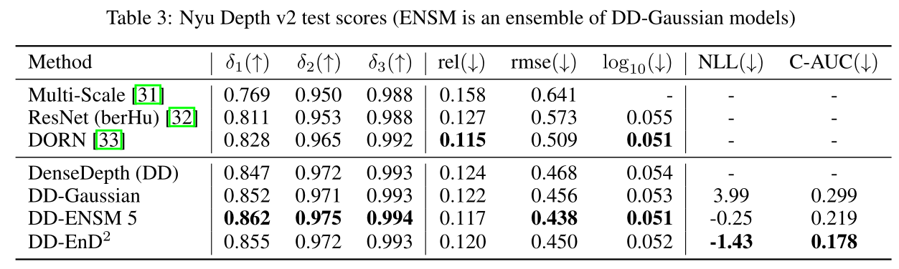

# [Regression Prior Networks](https://arxiv.org/abs/2006.11590)
An official PyTorch implementation of "Regression Prior Networks" for effective uncertainty estimation.

## Results
Example on Nyuv2 dataset (monocular depth estimation)


Performance metrics


## Installation
This repo was tested on Python 3.7.6 and PyTorch 1.4.0

All other requirements can be installed with conda
```bash
conda env create -f requirements.yml
```

## Data & Models

For Nyu training, we use the subsampled data (50K) from the [DenseDepth](https://github.com/ialhashim/DenseDepth) repo:

[Train data](https://tinyurl.com/nyu-data-zip) (4.1 GB) and [test data](https://s3-eu-west-1.amazonaws.com/densedepth/nyu_test.zip) (1.4 GB). Store them in data folder without unpacking.

All trained checkpoints (ensemble of gaussians, our model) can be found [here](https://drive.google.com/drive/folders/1jL-g3yALvhilkNFlP6_ahtb7PY6XqxIW?usp=sharing) (1.6 GB). Those should be extracted in checkpoints folder.

## Usage

To reproduce reported test metrics (table 3), run

```bash
bash experiments/reproduce_nyu_metrics.sh
```

OOD scores (table 4) may be reproduced with

```bash
bash experiments/reproduce_ood_scores.sh
```

Please note that we require additional [KITTI subset](https://drive.google.com/file/d/1kOLGi498371eLHJlu_NWe9o3NQ49kJUU/view?usp=sharing) (437 MB) for this. Unzip it in data folder.
(You may simply take first 654 images from test_depth_completion_anonymous if you have KITTI dataset)

Finally, to get individual examples use:

```bash
python get_nyu_samples.py --indices $DESIRED_INDICES
```

You may also retrain all Nyuv2 Gaussian models with:

```bash
python nyu_train.py --checkpoint $CHECKPOINT_FOLDER_PATH --model_type "gaussian"
```

and then distil them to NWP with:

```bash
python nyu_train.py --checkpoint $CHECKPOINT_FOLDER_PATH --teacher_checkpoints $PATHS_TO_TEACHERS --model_type "nw_prior"
```

Please note that by default it uses all available GPUs and requires ~18.2Gb of GPU memory.

## Training on your own data

1. Wrap the output from your model using one of our distribution_wrappers.
2. (If feasible) Train an ensemble of base models with NLL objective. You may inherit our NLLSingleDistributionTrainer or use smth similar.
3. (If feasible) Distill to a single Prior model by inheriting from DistillationTrainer class and training with it (look at nyu_trainers for an example).
4. (If 2-3 are not feasible, but you have ood data to train on) Use NWPriorRKLTrainer class for straightforward training. It requires additional hyperparameters - ood coefficient, inverse train beta and prior ood beta. Those should be tuned - we recommend starting with 0.1, 1e-2 and 1e-2 for them respectively.
5. During testing, wrap the output & get the prior distribution. You can get all desired uncertainties from it.

## ToDo

- [x] Advanced visualization of results
- [x] Training script
- [ ] Evaluation on KITTI

## Reference

If you find our work useful, please cite the corresponding paper:

```
@article{RPN20,
  author    = {Andrey Malinin, Sergey Chervontsev, Ivan Provilkov, Mark Gales},
  title     = {Regression Prior Networks},
  journal   = {arXiv e-prints},
  volume    = {abs/2006.11590},
  year      = {2020},
  url       = {https://arxiv.org/abs/2006.11590},
  eid       = {arXiv:2006.11590},
  eprint    = {2006.11590}
}
```
