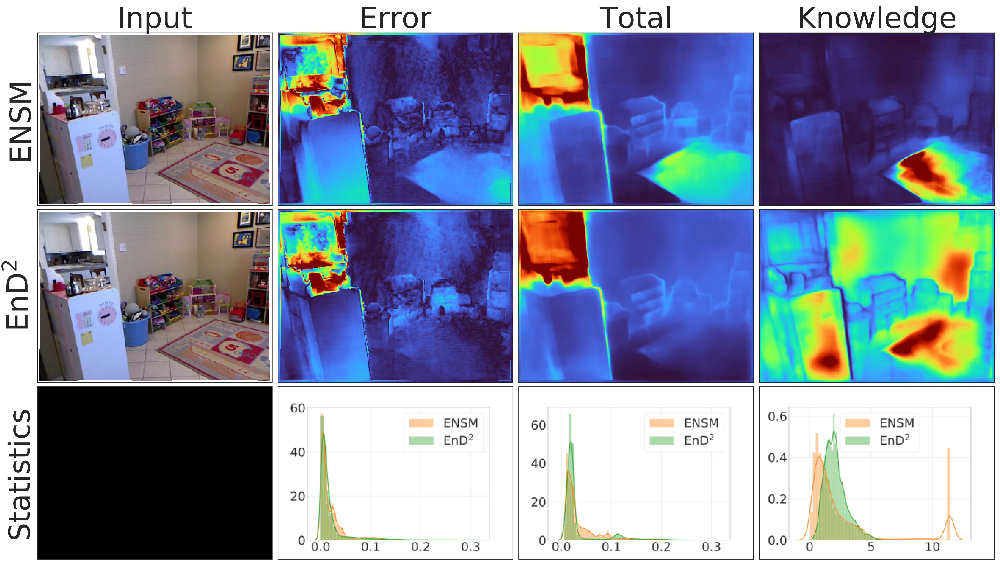

# Regression Prior Networks
An official PyTorch implementation of "Regression Prior Networks" for effective uncertainty estimation.

# Examples


# Reproducing

Download data from DenseDepth repository:

https://tinyurl.com/nyu-data-zip

Download our model checkpoints from:

https://drive.google.com/drive/folders/1jL-g3yALvhilkNFlP6_ahtb7PY6XqxIW?usp=sharing

store them in "checkpoints" folder.

To reproduce reported metrics, run

```bash
bash experiments/reproduce_nyu_metrics.sh
```
