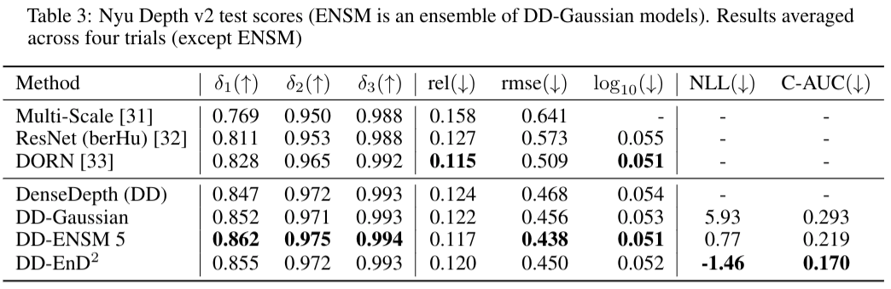

# Regression Prior Networks
An official PyTorch implementation of "Regression Prior Networks" for effective uncertainty estimation.

# Results
Example


Performance metrics


Calibration of predicted deviations vs ground truth errors


# Installation
This repo was tested on Python 3.7.6 and PyTorch 1.4.0

All other requirements can be installed with conda
```bash
conda env create -f requirements.yml
```

# Data & Models

For Nyu training, we use the subsampled data (50K) from the DenseDepth repo:

[Train data](https://tinyurl.com/nyu-data-zip) (4.1 GB) and [test data](https://s3-eu-west-1.amazonaws.com/densedepth/nyu_test.zip) (1.4 GB). 

store all zip files in data folder without unpacking them.

All trained checkpoints (ensemble of gaussians, our model) can be found [here](https://drive.google.com/drive/folders/1jL-g3yALvhilkNFlP6_ahtb7PY6XqxIW?usp=sharing) (1.6 GB).

Those should be extracted in checkpoints folder.

# Usage

To reproduce reported test metrics (table 3), run

```bash
bash experiments/reproduce_nyu_metrics.sh
```

OOD scores (table 4) may be reproduced with

```bash
bash experiments/reproduce_ood_scores.sh
```

Please note that we require additional [KITTI subset](https://drive.google.com/file/d/1kOLGi498371eLHJlu_NWe9o3NQ49kJUU/view?usp=sharing) (437 MB) for this. Unzip it in data folder.
(You may simply take first 654 images from test_depth_completion_anonymous if you have KITTI dataset)

Finally, to get individual examples use:

```bash
python get_nyu_samples.py --indices $DESIRED_INDICES
```

# ToDo

- [x] Advanced visualization of results
- [ ] Training script
- [ ] Evaluation on KITTI

# Reference

@article{Malinin20,
  author    = {Andrey Malinin, Sergey Chervontsev, Ivan Provilkov, Mark Gales},
  title     = {Regression Prior Networks},
  journal   = {arXiv e-prints},
  volume    = {abs/TOFILL},
  year      = {2018},
  url       = {TOFILL},
  eid       = {TOFILL},
  eprint    = {TOFILL}
}
