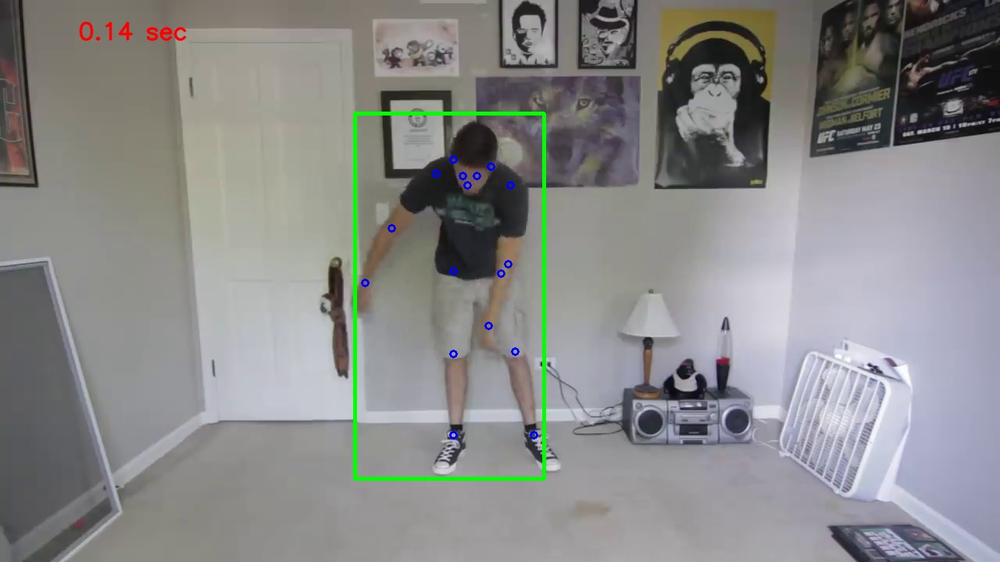
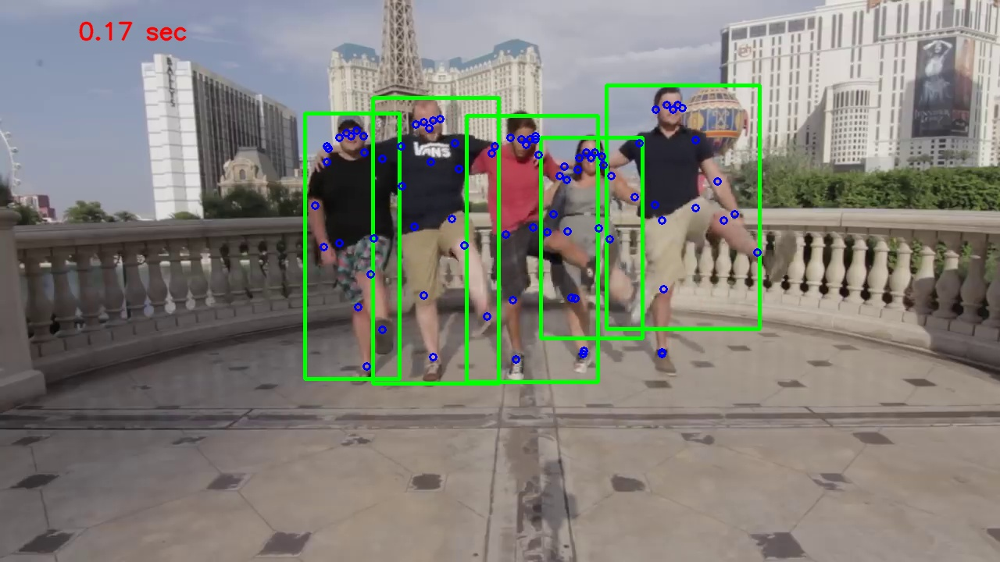

# Inference hrnet

Inferencing the deep-high-resolution-net.pytoch without using Docker. 

## Prep
1. Download the researchers' pretrained pose estimator from [google drive](https://drive.google.com/drive/folders/1hOTihvbyIxsm5ygDpbUuJ7O_tzv4oXjC?usp=sharing) to this directory under `models/`
2. Put the video file you'd like to infer on in this directory under `videos`
3. build the docker container in this directory with `./build-docker.sh` (this can take time because it involves compiling opencv)
4. update the `inference-config.yaml` file to reflect the number of GPUs you have available

## Running the Model
```
python inference.py --cfg inference-config.yaml \
    --videoFile ../../multi_people.mp4 \
    --writeBoxFrames \
    --outputDir output \
    TEST.MODEL_FILE ../models/pytorch/pose_coco/pose_hrnet_w32_256x192.pth 

```

The above command will create a video under *output* directory and a lot of pose image under *output/pose* directory. 
Even with usage of GPU (GTX1080 in my case), the person detection will take nearly **0.06 sec**, the person pose match will
 take nearly **0.07 sec**. In total. inference time per frame will be **0.13 sec**, nearly 10fps. So if you prefer a real-time (fps >= 20) 
 pose estimation then you should try other approach.

## Result

Some output image is as:


Fig: 1 person inference


Fig: 3 person inference


Fig: 3 person inference